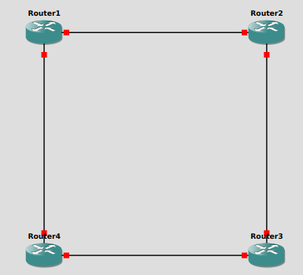

# Terraform Provider for GNS3

## Overview
The **Terraform Provider for GNS3** allows network engineers and DevOps professionals to automate the deployment and management of **GNS3 network topologies** using Terraform. This provider eliminates manual setup by enabling **Infrastructure as Code (IaC)** for network emulation environments.

## Features
- Create and manage **GNS3 nodes** (Routers, Switches, VMs, etc.).
- Define and configure **network links** between nodes.
- Automate **GNS3 topology deployment** with Terraform.
- Seamlessly integrate GNS3 network automation into CI/CD pipelines.

## Installation
### Prerequisites
- **Terraform** (>= v1.0.0)
- **GNS3 Server** (>= v2.2.0) installed and running
- **GNS3 API** enabled on your server

### Install the Provider
```bash
terraform init
```

### Configure the Provider
Add the following to your Terraform configuration:
```hcl
terraform {
  required_providers {
    gns3 = {
      source  = "netopschic/gns3"
      version = "1.0.1"
    }
  }
}

# Configure the GNS3 provider
provider "gns3" {
  host = "http://localhost:3080"
}
```
## Files

- `provider.tf`: Configures the GNS3 provider.
- `variables.tf`: Defines input variables.
- `main.tf`: Contains resource definitions.
- `outputs.tf`: Specifies output values.

## Template for router
```hcl
data "gns3_template_id" "router_template" {
  name = "c7200"  # Replace with the actual router template name
}

```
## Usage (For Quick Spin!)
### Creating a Project
```hcl
resource "gns3_project" "project1" {
  name = "My-first-test-topology"
}

```
### Creating a GNS3 Node
```hcl
resource "gns3_node" "router1" {
  project_id  = "your_project_id"
  name        = "Router1"
  template    = "cisco_ios"
  x           = 100
  y           = 200
}
```

### Creating a Link Between Nodes
```hcl
resource "gns3_link" "router1_to_switch" {
  project_id = "your_project_id"
  node_a     = gns3_node.router1.id
  node_b     = gns3_node.switch1.id
}
```

## Example Topology



A **basic topology** connecting a router and a switch:
```hcl
# Define four routers positioned in a square layout
resource "gns3_node" "router1" {
  project_id  = gns3_project.project1.project_id
  template_id = data.gns3_template_id.router_template.template_id
  name        = "Router1"
  compute_id  = "local"
  x           = 100
  y           = 100
}

resource "gns3_node" "router2" {
  project_id  = gns3_project.project1.project_id
  template_id = data.gns3_template_id.router_template.template_id
  name        = "Router2"
  compute_id  = "local"
  x           = 500
  y           = 100
}

resource "gns3_node" "router3" {
  project_id  = gns3_project.project1.project_id
  template_id = data.gns3_template_id.router_template.template_id
  name        = "Router3"
  compute_id  = "local"
  x           = 500
  y           = 500
}

resource "gns3_node" "router4" {
  project_id  = gns3_project.project1.project_id
  template_id = data.gns3_template_id.router_template.template_id
  name        = "Router4"
  compute_id  = "local"
  x           = 100
  y           = 500
}

# Define links to form a square topology
resource "gns3_link" "link1" {
  project_id      = gns3_project.project1.project_id
  node_a_id       = gns3_node.router1.id
  node_a_adapter  = 4  # Slot 4
  node_a_port     = 0  # ✅ Port 0
  node_b_id       = gns3_node.router2.id
  node_b_adapter  = 4  # Slot 4
  node_b_port     = 1  # ✅ Port 1
}

resource "gns3_link" "link2" {
  project_id      = gns3_project.project1.project_id
  node_a_id       = gns3_node.router2.id
  node_a_adapter  = 4  # Slot 4
  node_a_port     = 2  # ✅ Port 2
  node_b_id       = gns3_node.router3.id
  node_b_adapter  = 4  # Slot 4
  node_b_port     = 3  # ✅ Port 3
}

resource "gns3_link" "link3" {
  project_id      = gns3_project.project1.project_id
  node_a_id       = gns3_node.router3.id
  node_a_adapter  = 4  # Slot 4
  node_a_port     = 4  # ✅ Port 4
  node_b_id       = gns3_node.router4.id
  node_b_adapter  = 4  # Slot 4
  node_b_port     = 5  # ✅ Port 5
}

resource "gns3_link" "link4" {
  project_id      = gns3_project.project1.project_id
  node_a_id       = gns3_node.router4.id
  node_a_adapter  = 4  # Slot 4
  node_a_port     = 6  # ✅ Port 6
  node_b_id       = gns3_node.router1.id
  node_b_adapter  = 4  # Slot 4
  node_b_port     = 7  # ✅ Port 7
}

```

## Roadmap
- [ ] Improve provider stability and error handling.
- [ ] Add resource for more network devices
- [ ] Enhance state management

## Contributing
Contributions are welcome! To contribute:
1. Fork the repository.
2. Create a new feature branch.
3. Commit your changes.
4. Open a pull request.

## Issues & Feedback
For issues, feature requests, or general discussion, please open a GitHub issue

## License
This project is licensed under the **MIT License**.

---
🚀 **Created & Maintained by [NetOpsChic](https://github.com/netopschic)**